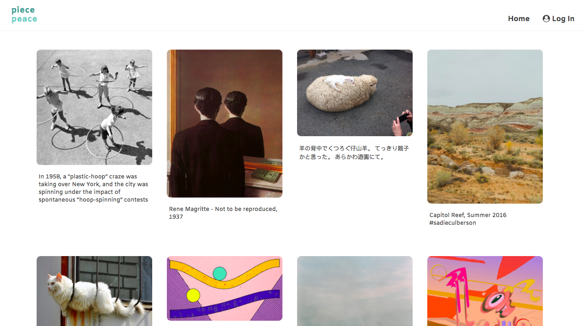

# Piece Peace

Piece Peace is inspired by Pinterest, and is an app where you save and manage images by creating boards.




## Repositories
- [Front-end repo](https://github.com/sarah-yu/piece-peace)
- [Deployed app](http://piece-peace.surge.sh)
- [Back-end repo](https://github.com/sarah-yu/piece-peace-api)
- [Deployed api](http://piece-peace-api.herokuapp.com)


## Technologies
- MERN Stack (MongoDB, Express, React, Node)
- HTML/CSS
- JavaScript


## Installation
1. Fork and clone the [back-end repo](https://github.com/sarah-yu/piece-peace-api) and run ```npm install```.
2. Run ```node index.js``` to start the Express server.
3. Fork and clone this repo and run ```npm install```.
4. Run ```npm start```.


## Planning
- User stories (will be adding a link to this soon)
- [Wireframe](./public/wireframe.JPG)
- [Tree](./public/tree.jpg)


## Unsolved Problems / Known Issues
- Currently, some CRUD functionality requires a page refresh to render the changes in the browser.
- Users can create an account, but the User model is currently not related in any way to the other models.
- I was not able to figure out image upload.
- I am still working on making a bookmarklet so that users can save images from around the web.
